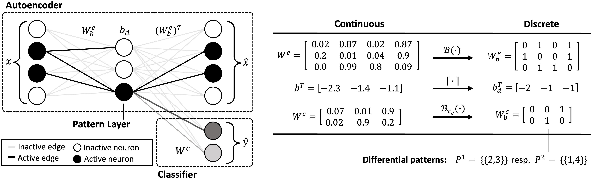

## Finding Interpretable Class-Specific Patterns through Efficient Neural Search


<p align=center >

</p>

This is the python implementation accompanying the paper [*Finding Interpretable Class-Specific Patterns through Efficient Neural Search*](https://arxiv.org/abs/2312.04311) by
[Nils Philipp Walter](https://nilspwalter.github.io/), [Jonas Fischer](https://explainablemachines.github.io/group_website/members/jonas-fischer.html) and [Jilles Vreeken](https://vreeken.eu/).
The code is based on [1] and is available under the license GNU General Public License v3.0. We strongly recommend to run the code on a GPU. To reproduce the results for
high-dimensional data a GPU with 40GB of memory is required.

### 1. Required packages
- PyTorch
- Numpy
- Pandas

### 2. Folder organization
- **code:** Contains the code of our method, *Diffnaps*, and scripts to reproduce all the reults presented in the paper
- **data:** Data used for the experiments for real data. Due to the upload limit *genomes* is not included
- **results:** Directory to store the results outputted by the scripts in **code**
- **appendix.pdf**: Contains appendix for the main paper 

### 3. Running experiments
To run the experiments on **synthetic data**, the scripts `exp1.py`, `exp2.py`, `exp3.py` and `exp4.py` 
need to be executed. The experiments for sclability in number of features and number of classes 
can be found in `exp1.py` and `exp2.py`, respectively. The thrid experiment i.e. robustness 
to noise is split into two scripts. The file `exp3.py` contains the code for the addive noise and
file `exp4.py` the code for the destructuive noise.

To reprocuce the results on **real data** the python script `real_exp.py` can be used. The dataset name
correspond to the names in the paper. So for DATASET $\in$ [cardio, disease, brca-n, brca-s, genomes],

`python3 real_exp.py -d DATASET` ,

executes *Diffnaps* for the specified dataset. The results are saved to `results/real_results/`.


[1] Fischer, J.; and Vreeken, J. 2021. Differentiable pattern set mining.
    In Proceedings of the ACM International Conference on Knowledge Discovery and Data Mining (SIGKDD)

### 4. Citation
If you find our work useful for your research, please consider citing:
```
@inproceedings{walter2024finding,
  title = {Finding Interpretable Class-Specific Patterns through Efficient Neural Search},
  author = {Walter, Nils Philipp and Fischer, Jonas and Vreeken, Jilles},
  booktitle = {Proceedings of the 38th Annual AAAI Conference on Artificial Intelligence},
  year = {2024},
  organization = {AAAI},
}
```


### 5. License

This work is licensed under [GNU General Public License 3](https://www.gnu.org/licenses/gpl-3.0.html).

